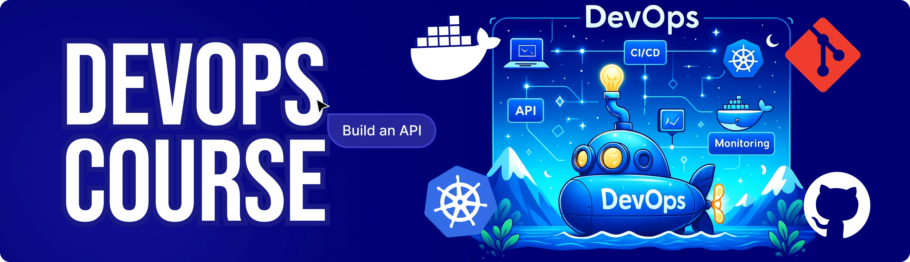

<div align="center">
  <br />
    <a href="https://youtu.be/H5FAxTBuNM8" target="_blank">
      
    </a>
  <br />

  <div>


  </div>

  <h3 align="center">Build a Scalable Production Ready API</h3>

   <div align="center">
     Build this project step by step with our detailed tutorial on <a href="https://www.youtube.com/watch?v=XUkNR-JfHwo" target="_blank"><b>JavaScript Mastery</b></a> YouTube. Join the JSM family!
    </div>
</div>

## 📋 <a name="table">Table of Contents</a>

1. ✨ [Introduction](#introduction)
2. ⚙️ [Tech Stack](#tech-stack)
3. 🔋 [Features](#features)
4. 🤸 [Quick Start](#quick-start)
5. 🔗 [Assets](#links)
6. 🚀 [More](#more)

## 🚨 Tutorial

This repository contains the code corresponding to an in-depth tutorial available on our YouTube channel, <a href="https://www.youtube.com/@javascriptmastery/videos" target="_blank"><b>JavaScript Mastery</b></a>.

If you prefer visual learning, this is the perfect resource for you. Follow our tutorial to learn how to build projects like these step-by-step in a beginner-friendly manner!

<a href="https://youtu.be/H5FAxTBuNM8" target="_blank"></a>

## <a name="introduction">✨ Introduction</a>

Master DevOps by taking an API from code to production with Docker, Kubernetes, Git & GitHub, Warp, and CI/CD Actions! Build a scalable backend using Node.js, Express.js, Neon Postgres, and Drizzle ORM, while testing ensures reliability at every step. Learn to containerize services, orchestrate deployments, automate pipelines, and monitor applications—perfect for developers who want hands-on experience shipping robust, production-ready systems.

If you're getting started and need assistance or face any bugs, join our active Discord community with over **50k+** members. It's a place where people help each other out.

<a href="https://discord.com/invite/n6EdbFJ" target="_blank"></a>

## <a name="tech-stack">⚙️ Tech Stack</a>

- **[Arcjet](https://jsm.dev/dops25-arcjet)** is a developer-first security layer that enables you to protect your applications with minimal code. It offers features like bot protection, rate limiting, email validation, and defense against common attacks. Arcjet's SDK integrates seamlessly into your application, providing real-time security decisions without the need for additional infrastructure.


- **[Docker](https://www.docker.com/)** is a leading containerization platform that allows you to package applications along with all their dependencies into portable, lightweight containers. This ensures consistent behavior across different environments, simplifies deployment, and makes scaling applications more efficient.  

- **[Kubernetes](https://kubernetes.io/)** is an open-source orchestration system designed to automate the deployment, scaling, and management of containerized applications. It handles tasks like load balancing, self-healing, and rolling updates, making it essential for running applications reliably at scale.  

- **[Warp](https://jsm.dev/dops25-warp)** is a modern terminal built in Rust, optimized for developer productivity. It offers features like AI-assisted commands, easy collaboration, command history search, and a faster, more intuitive interface compared to traditional terminals.  

- **[Node.js](https://nodejs.org/)** is a fast, event-driven JavaScript runtime built on Chrome’s V8 engine. It enables developers to build scalable, high-performance server-side applications and APIs using JavaScript on both the client and server side.  

- **[Express.js](https://expressjs.com/)** is a minimal and flexible Node.js web application framework. It provides robust features for building APIs and server-side applications, including routing, middleware support, and simplified request/response handling.  

- **[Neon Postgres](https://jsm.dev/dops25-neon)** is a fully managed, serverless Postgres database designed for modern cloud applications. It offers autoscaling, branching for development workflows, and simplifies database management without compromising performance.  

- **[Drizzle ORM](https://orm.drizzle.team/)** is a TypeScript-first, lightweight ORM for SQL databases. It provides type safety, schema migrations, and an intuitive API for building reliable and maintainable database queries.  

- **[Zod](https://zod.dev/)** is a TypeScript-first schema validation library that ensures runtime type safety. It helps developers validate data structures, enforce strict type checks, and catch errors early in the development process.  

## <a name="features">🔋 Features</a>

👉 **Absolute Imports**: Clean import paths using `#` prefix aliases for more organized and readable code.  

👉 **Business Listings**: Create, update, delete, and browse business listings efficiently.  

👉 **Database Integration**: Integrate PostgreSQL with Drizzle ORM, including migrations for schema management.  

👉 **Deal Management**: Create deals on listings, accept or reject offers, and track deal status.  

👉 **Docker Support**: Full containerization with development and production environments for consistent deployment.  

👉 **ESLint + Prettier**: Enforce code linting and formatting rules for cleaner, consistent code.  

👉 **Health Monitoring**: Endpoint to check system health and monitor overall application status.  

👉 **Hot Reload**: Development server automatically restarts on file changes for faster iteration.  

👉 **Jest Testing**: Framework for unit and integration testing with SuperTest for HTTP endpoints.  

👉 **Request Validation**: Validate all API inputs using Zod schemas to ensure data integrity.  

👉 **Role-Based Access Control**: Implement admin and user roles with permission middleware for secure operations.  

👉 **Structured Logging**: Winston-based logging throughout the application for better monitoring and debugging.  

👉 **User Authentication & Authorization**: JWT-based authentication supporting signup, signin, and signout workflows.  

👉 **User Management**: CRUD operations for user accounts, enabling easy administration and management.


And many more, including code architecture and reusability.

## <a name="quick-start">🤸 Quick Start</a>

Follow these steps to set up the project locally on your machine.

**Prerequisites**

Make sure you have the following installed on your machine:

- [Git](https://git-scm.com/)
- [Node.js](https://nodejs.org/en)
- [npm](https://www.npmjs.com/) (Node Package Manager)

**Cloning the Repository**

```bash
git clone https://github.com/adrianhajdin/acquisitions.git
cd acquisitions
```

**Installation**

Install the project dependencies using npm:

```bash
npm install
```

**Set Up Environment Variables**

Create a new file named `.env` in the root of your project and add the following content:

```env
# Server Configuration
PORT=3000
NODE_ENV=development
LOG_LEVEL=info

# Database Configuration
DATABASE_URL=

# Arcjet
ARCJET_KEY=
```

Replace the placeholder values with your real credentials. You can get these by signing up at: [**Arcjet**](https://jsm.dev/dops25-arcjet), [**Neon**](https://jsm.dev/dops25-neon).

**Running the Project**

```bash
npm run dev
```

Open [http://localhost:3000](http://localhost:3000) in your browser to view the project.

## <a name="links">🔗 Assets</a>

Assets and snippets used in the project can be found in the **[video kit](https://jsm.dev/dops25-kit)**.

<a href="https://jsm.dev/dops25-kit" target="_blank">
  
</a>

## <a name="more">🚀 More</a>

**Advance your skills with Next.js Pro Course**

Enjoyed creating this project? Dive deeper into our PRO courses for a richer learning adventure. They're packed with
detailed explanations, cool features, and exercises to boost your skills. Give it a go!

<a href="https://jsm.dev/dops25-jsm" target="_blank">
  
</a>